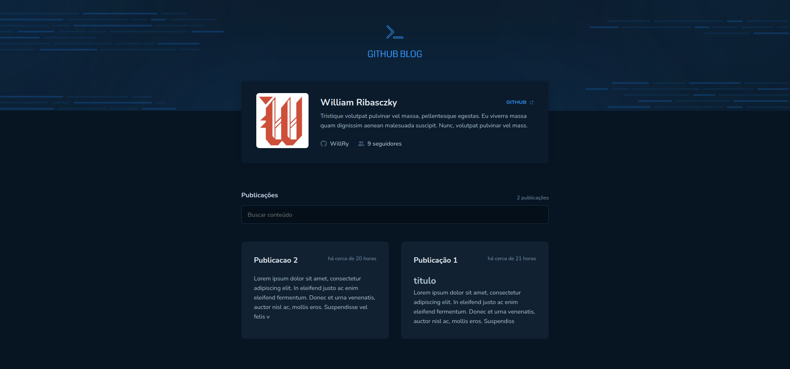
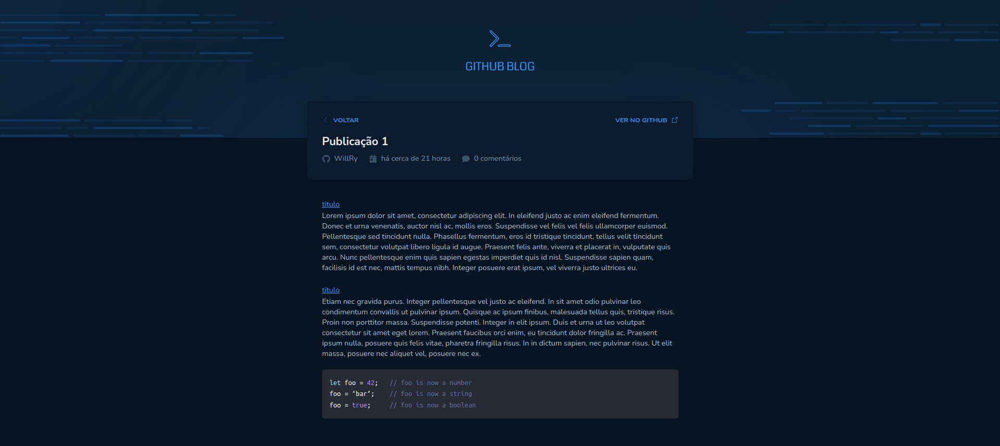

# Desafio - Github Blog - ignite

Desafio "Desafio 03 - Desafio: Github blog" proposto pelo curso Ignite da RocketSeat, na trilha de React.JS

## Propósito do desafio

O propósito do desafio é implementar uma aplicação simples a partir de um protótipo, que contém os seguintes conceitos:

- Rotas
- ContextAPI
- Styled Components
- Consumo de APIs
- Componentes de terceiros, como sintax highlight

## Aplicação

A aplicação consiste em um mini-blog, onde os posts são exibidos/salvos em issues do github

## Demonstração

